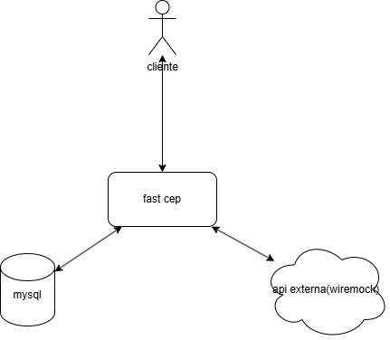

# 📦 FAST CEP API

Aplicação Spring Boot que consulta CEPs usando mocks do WireMock e armazena dados da consulta em banco. Aplicação criada no Modelo MVC separando cada camada da aplicação sua responsabilidade com o objetivo simples e rápido de mockarmos uma consulta de CEP com wiremock.

---

## 🧩 Diagrama da solução

---

## 🚀 Tecnologias

- Java 17+
- Spring Boot
- Spring Data JPA
- MySQL
- WireMock
- Maven
- Docker

---

## 🧩 Arquitetura

A aplicação segue uma arquitetura em camadas:

- Controller → entrada HTTP
- Service → regra de negócio
- Repository → acesso ao banco
- WireMock → simulação de API externa

---

## 🔄 Fluxo da aplicação

1. Cliente chama `/consulta_cep/{cep}`
2. API consulta mock via WireMock
3. Dados retornados são persistidos no MySQL
4. Resposta é enviada ao cliente

---

## 🔧 Como rodar o projeto

### Pré-requisitos

- Java 17+
- Maven
- MySQL
- Docker (opcional)

### Build e start: 
- docker compose up --build
